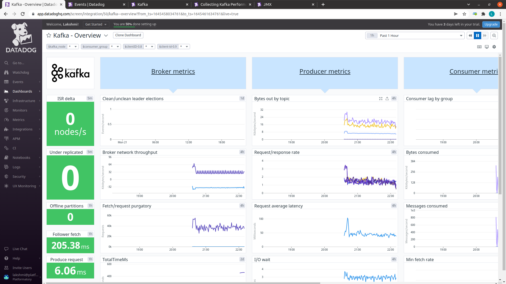

A Kafka / Confluent GitOps workflow example for multi-env deployments with Flux, Kustomize, Helm and Confluent Operator.

## Usage

For this example we assume a single cluster simulating a production confluent environment. The end goal is to leverage Flux and Kustomize to manage [Confluent Operator for Kubernetes](https://github.com/confluentinc/operator-earlyaccess). You can extend with another cluster while minimizing duplicated declarations.

We will configure [Flux](https://fluxcd.io/) to install, deploy and config the [Confluent Platform](https://www.confluent.io/product/confluent-platform) using their `HelmRepository` and `HelmRelease` custom resources.
Flux will monitor the Helm repository, and can be configured to automatically upgrade the Helm releases to their latest chart version based on semver ranges.


## Prerequisites

## Tools needed

1. kubectl
2. confluent platform CLI binaries
3. kustomize(optional)
4. helm(optional)
5. Flux CLI(optional)

### Overall prerequisites

1. A CNCF compatible Kubernetes cluster.

2. A kubernetes secret in the flux-system namespace to store git ssh credentials. This is required by Flux to sync private repositories.

```
ssh-keygen -q -N "" -f ./identity
ssh-keyscan github.com > ./known_hosts

kubectl create secret generic ssh-credentials \
    --from-file=./identity \
    --from-file=./identity.pub \
    --from-file=./known_hosts -n flux-system
```

3. Configuration and setup of openldap. This is used as an interim LDAP server in place of LDAP-configured Azure AD.

```
helm upgrade --install -f assets/openldap/ldaps-rbac.yaml test-ldap assets/openldap --namespace confluent
```

Check whether LDAP is working correctly.

```
kubectl --namespace confluent exec -it ldap-0 -- bash

$ ldapsearch -LLL -x -H ldap://ldap.confluent.svc.cluster.local:389 -b 'dc=test,dc=com' -D "cn=mds,dc=test,dc=com" -w 'Developer!'
```

Optionally, an openldap instance can be deployed for each confluent cluster if needed, with its own set of groups and users.

4. Portworx storage class

Create a new storage class using the following command:

```
kubectl apply -f portworx.yaml
```
The storage class can be changed in the `kustomize/base/confluent` directory for each individual kafka component.

```
  storageClass:
    name: confluent-portworx-sc  
```


### Per cluster prerequisites

**NOTE** It is recommended to deploy one confluent cluster per namespace. Thus, all the following resources are created in the cluster's namespace.

1. Self signed keys for autogeneration of certificates. These certificates are used for inter-component TLS communication which is mandatory for a production setup.

Generate a CA pair to use.

Then, provide the certificate authority as a Kubernetes secret `ca-pair-sslcerts`. The name of the secret is by convention and should not be anything else.

```
cd certs
openssl genrsa -out ca-key.pem 2048
openssl req -new -key ca-key.pem -x509 \
  -days 1000 \
  -out ca.pem \
  -subj "/C=US/ST=CA/L=MountainView/O=Confluent/OU=Operator/CN=TestCA"
```

```
kubectl -n <cluster-namespace> create secret tls ca-pair-sslcerts \
    --cert=certs/ca.pem \
    --key=certs/ca-key.pem 
```

2. Kubernetes secret for external access TLS.

```
kubectl create secret generic tls-group1 \
  --from-file=fullchain.pem=generated/server.pem \
  --from-file=cacerts.pem=generated/ca.pem \
  --from-file=privkey.pem=generated/server-key.pem \
  --namespace <cluster-namespace>
```

**NOTE** This command might vary slightly if you are using certificates purchased from a certificate authority.

3. Authentication credentials.

```
kubectl create secret generic credential \
  --from-file=plain-users.json=credentials/creds-kafka-sasl-users.json \
  --from-file=digest-users.json=credentials/creds-zookeeper-sasl-digest-users.json \
  --from-file=digest.txt=credentials/creds-kafka-zookeeper-credentials.txt \
  --from-file=plain.txt=credentials/creds-client-kafka-sasl-user.txt \
  --from-file=basic.txt=credentials/creds-control-center-users.txt \
  --from-file=ldap.txt=credentials/ldap.txt \
  --namespace <cluster-namespace>
```

4. RBAC principal credentials

Create the MDS token.

```
cd mds
openssl genrsa -out mds-tokenkeypair 2048
openssl rsa -in mds-tokenkeypair -outform PEM -pubout -out mds-publickey
```

```
kubectl create secret generic mds-token \
  --from-file=mdsPublicKey.pem=mds/mds-publickey \
  --from-file=mdsTokenKeyPair.pem=mds/mds-tokenkeypair \
  --namespace <cluster-namespace>
```

Component RBAC credentials.

```
# Kafka RBAC credential
kubectl create secret generic mds-client \
  --from-file=bearer.txt=credentials/bearer.txt \
  --namespace <cluster-namespace>
# Control Center RBAC credential
kubectl create secret generic c3-mds-client \
  --from-file=bearer.txt=credentials/c3-mds-client.txt \
  --namespace <cluster-namespace>
# Connect RBAC credential
kubectl create secret generic connect-mds-client \
  --from-file=bearer.txt=credentials/connect-mds-client.txt \
  --namespace <cluster-namespace>
# Schema Registry RBAC credential
kubectl create secret generic sr-mds-client \
  --from-file=bearer.txt=credentials/sr-mds-client.txt \
  --namespace <cluster-namespace>
# ksqlDB RBAC credential
kubectl create secret generic ksqldb-mds-client \
  --from-file=bearer.txt=credentials/ksqldb-mds-client.txt \
  --namespace <cluster-namespace>
# Kafka REST credential
kubectl create secret generic rest-credential \
  --from-file=bearer.txt=credentials/bearer.txt \
  --from-file=basic.txt=credentials/bearer.txt \
  --namespace <cluster-namespace>
```

5. A cluster level domain name

We need to configure a cluster domain name. All the YAML templates have "my.domain.com". This should be replaced with a customized cluster domain name. The general naming convention is:

```
confluent-<component>-<cloud>-<env>.domain.com
```

for instance, the kafka DNS in Alicloud sandbox will be `confluent-kafka-ali-sandbox.domain.com`.

## Repository structure

The Git repository contains the following top directories:

- **flux-system** dir contains the required kubernetes resources for flux to operate
- **kustomize/base** dir contains the base definition of the confluent stack.
- **kustomize/environments** dir containing an example environment, folders could be copied to create additional environments.  Files within are 'patches' which are layered on top of the definitions found in kustomize/base
- **kustomize/operator** dir the helm chart definition for confluent-for-kubernetes (CFK).


```
├── flux-system
├── kustomize
│   ├── base
│   │   ├── confluent
│   ├── environments
│   │   └── sandbox
│   └── operator
```

## Initial scaffold
In order to showcase the GitOps behaviour of the FluxCD toolkit you will require the ability to write to a repository.  Fork this repository, and update line 11 of the file `./flux-system/gotk-sync.yaml` to the new https git address of your forked repository.  Also make note of line 10 'branch'; this is the branch of the repository which Flux will monitor actively.

### Deploy base Flux components
#### Overview
This step will install the base Flux kubernetes components onto your kubernetes cluster.  To inspect what is being applied, simply look through the contents of `./flux-system/gotk-components.yaml`.  You will see a mix of Custom Resource Definitions, Service Accounts, Deployments, and other various components.  After the application of these resource definitions is completed, you should see the following pods running:

* Helm-Controller
* Kustomize Controller
* Notification Controller
* Source Controller

For more information on what these controllers do, please review [the documentation here](https://fluxcd.io/docs/components/).


### Deployment Process
* Navigate to `./flux-system`
* Run `kubectl apply -f gotk-components.yaml`


### Deploy Flux Sync
#### Overview
This next step will tell Flux what repository to monitor, and, within that repository, what kustomization files to start with.  The first Kustomize resource that Flux will look for to is located at `./kustomize/operator`.  This will install the confluent-for-kubernetes Helm chart and nginx controller.  

### Deployment Process
* Navigate to `./flux-system`
* run `kubectl apply -f gotk-sync.yaml`

### Some customization parameters

1. The Confluent operator only manages Confluent Kafka clusters in the specific namespace it is installed in. This behaviour is overridden where we've installed a global per cluster Confluent operator pod in `kustomize/operator/confluent-operator-helm-release-confluent.yaml` line #38.

```
    namespaced: false
```

2. The Confluent operator is installed in an `operators` namespace where conventionally other operators are installed. This can be changed in `kustomize/operator/namespaces.yaml` file and `kustomize/operator/confluent-operator-helm-release-confluent.yaml` line #14.

```
  namespace: operators
```

3. Nginx controller is installed in default namespace. We will be provisioning a cluster with static host based access.
In many load balancer use cases, the decryption happens at the load balancer, and then unencrypted data is passed along to the endpoint. This is known as SSL termination. With the Kafka protocol, however, the broker expects to perform the SSL handshake directly with the client. To achieve this, SSL passthrough is required. SSL passthrough is the action of passing data through a load balancer to a server without decrypting it. Therefore, we configure this parameter in the nginx controller installation in file `kustomize/operator/nginx-controller-helm-release.yaml` line #35:

```
  values:
    controller.extraArgs.enable-ssl-passthrough: true
```

## Sandbox cluster

 After a successful installation of Confluent operator and Nginx controller, we will proceed to deploy our first environment located at  `./kustomize/environments/sandbox`.


### Deployment Process
* Navigate to `./flux-system`
* run `kubectl apply -f sandbox-cluster.yaml`

Please add A entries in the DNS provider for each of the component ingresses. This will point to the external IP of the nginx ingress controller service.

```
$ kubectl get svc
NAME                                 TYPE           CLUSTER-IP     EXTERNAL-IP     PORT(S)                      AGE
ingress-nginx-controller             LoadBalancer   10.0.37.51     52.226.213.45   80:30899/TCP,443:32165/TCP   3d17h
```

### Demostrating Gitops of the installed cluster

Now that we have flux monitoring the forked Git repository, let's demonstrate the GitOps behaviour!  If everything has deployed successfully, you should see a healthy confluent stack looking like this:
```console
$ kubectl get pod
NAME                                        READY   STATUS     RESTARTS   AGE
confluent-operator-7cd67bfdc5-gxfdx         1/1     Running    0          37h
connect-0                                   0/1     Running    0          44s
connect-1                                   1/1     Running    0          6m53s
controlcenter-0                             1/1     Running    0          4h38m
ingress-nginx-controller-5bb9984b7b-dbj45   1/1     Running    0          106m
kafka-0                                     1/1     Running    0          58m
kafka-1                                     1/1     Running    0          11h
kafka-2                                     1/1     Running    0          11h
ksqldb-0                                    1/1     Running    0          148m
ksqldb-1                                    1/1     Running    0          151m
schemaregistry-0                            1/1     Running    0          13h
zookeeper-0                                 1/1     Running    0          14h
zookeeper-1                                 1/1     Running    0          14h
zookeeper-2                                 1/1     Running    0          14h
```

Let's ensure all the rolebindings are created as well.

```
$ kubectl get confluentrolebindings -n confluent
NAME                        STATUS    KAFKACLUSTERID           PRINCIPAL        ROLE             KAFKARESTCLASS      AGE
c3-pageviews                CREATED   Zy5MLHH1QTCFlZ07RlAW_w   User:c3          ResourceOwner    confluent/default   4h5m
connect-pageviews           CREATED   Zy5MLHH1QTCFlZ07RlAW_w   User:connect     ResourceOwner    confluent/default   4h2m
internal-connect-0          CREATED   Zy5MLHH1QTCFlZ07RlAW_w   User:connect     SecurityAdmin    confluent/default   4h41m
internal-connect-1          CREATED   Zy5MLHH1QTCFlZ07RlAW_w   User:connect     ResourceOwner    confluent/default   4h41m
internal-connect-2          CREATED   Zy5MLHH1QTCFlZ07RlAW_w   User:connect     DeveloperWrite   confluent/default   4h41m
internal-controlcenter-0    CREATED   Zy5MLHH1QTCFlZ07RlAW_w   User:c3          SystemAdmin      confluent/default   4h41m
internal-ksqldb-0           CREATED   Zy5MLHH1QTCFlZ07RlAW_w   User:ksql        ResourceOwner    confluent/default   4h41m
internal-ksqldb-1           CREATED   Zy5MLHH1QTCFlZ07RlAW_w   User:ksql        ResourceOwner    confluent/default   4h41m
internal-ksqldb-2           CREATED   Zy5MLHH1QTCFlZ07RlAW_w   User:ksql        DeveloperWrite   confluent/default   4h41m
internal-schemaregistry-0   CREATED   Zy5MLHH1QTCFlZ07RlAW_w   User:sr          SecurityAdmin    confluent/default   4h41m
internal-schemaregistry-1   CREATED   Zy5MLHH1QTCFlZ07RlAW_w   User:sr          ResourceOwner    confluent/default   4h41m
testadmin-rb                CREATED   Zy5MLHH1QTCFlZ07RlAW_w   User:testadmin   ClusterAdmin     confluent/default   4h35m
testadmin-rb-connect        CREATED   Zy5MLHH1QTCFlZ07RlAW_w   User:testadmin   SystemAdmin      confluent/default   4h35m
testadmin-rb-ksql           CREATED   Zy5MLHH1QTCFlZ07RlAW_w   User:testadmin   ResourceOwner    confluent/default   4h35m
testadmin-rb-sr             CREATED   Zy5MLHH1QTCFlZ07RlAW_w   User:testadmin   SystemAdmin      confluent/default   4h35m
```


To exhibit Flux, let's change our kafka replicas from the default of 3, to 4:

* In the file `./kustomize/environments/sandbox/kafka.yaml` uncomment the line `#  replicas: 4`, commit that change to your repository (git), and push upstream.   The next time flux performs a 'sync' (observable in the 'source controller' logs), it will the change to the kafka spec, and in turn increase our kafka cluster from size '3' to '4'.


## Simple producer and consumer from the CLI

Configure `kafka.properties`.

```
bootstrap.servers=kafka.my.domain.com:443
security.protocol=SASL_SSL
sasl.mechanism=PLAIN
sasl.jaas.config=org.apache.kafka.common.security.plain.PlainLoginModule required \
  username="kafka" \
  password="kafka-secret";
ssl.truststore.location=client.truststore.p12
ssl.truststore.password=mystorepassword
ssl.truststore.type=PKCS12
```

For this, we need to generate an optional truststore if our TLS is self signed.

```
keytool -import -trustcacerts -noprompt \
  -alias rootCA \
  -file $TUTORIAL_HOME/certs/cacerts.pem \
  -keystore $TUTORIAL_HOME/client/client.truststore.p12 \
  -deststorepass mystorepassword \
  -deststoretype pkcs12
```

Create a topic.

```
kubectl apply -f clients/topic.yml
```

Run producer in one window.

```
kafka-console-producer --bootstrap-server kafka.my.domain.com:443 --topic test --producer.config clients/kafka.properties
```

Run consumer in another window.

```
kafka-console-consumer --bootstrap-server kafka.my.domain.com:443 --topic test --consumer.config clients/kafka.properties
```

## Kafka connect

### How to configure connect plugins

New connect plugins can be added by configuring the YAML for connect in the `build` section.

```
  build:
    type: onDemand
    onDemand:
      plugins:
        locationType: confluentHub
        confluentHub:
          - name: kafka-connect-datagen
            owner: confluentinc
            version: 0.5.2
```
Once this is done and committed to the repo, it will reflect automatically in control center UI.

### How to add new topic

Topics can be added by Kubernetes native CRs.

Ex:

```
apiVersion: platform.confluent.io/v1beta1
kind: KafkaTopic
metadata:
  name: elastic-0
  namespace: confluent
spec:
  replicas: 1
  partitionCount: 1
  kafkaRest:
    authentication:
      type: bearer
      bearer:
        secretRef: rest-credential
  configs:
    cleanup.policy: "delete"
  kafkaRestClassRef:
    name: default
```

The `kafkaRestClassRef` is important in an RBAC enabled environment. Without this, the topic won't be created. They can be managed like any other kubernetes resource.

```
$ kubectl get topic -n confluent
NAME        REPLICAS   PARTITION   STATUS    CLUSTERID                AGE
pageviews   3          1           CREATED   Zy5MLHH1QTCFlZ07RlAW_w   4h56m

```

### How to add new connector

Connect workers are Kubernetes managed resources.

Ex:

```
apiVersion: platform.confluent.io/v1beta1
kind: Connector
metadata:
  name: pageviews
  namespace: confluent
spec:
  class: "io.confluent.kafka.connect.datagen.DatagenConnector"
  taskMax: 4
  connectClusterRef:
    name: connect
  configs:
    kafka.topic: "pageviews"
    quickstart: "pageviews"
    key.converter: "org.apache.kafka.connect.storage.StringConverter"
    value.converter: "org.apache.kafka.connect.json.JsonConverter"
    value.converter.schemas.enable: "false"
    max.interval: "100"
    iterations: "100000"
  connectRest:
    authentication:
      type: bearer
      bearer:
        secretRef: rest-credential
```

The `connectRest` section is important in an RBAC setting. The connect user, the SASL user need to have permissions to write to and read from this topic. Hence, we have to specify ACLs for the same.

```
kubectl apply -f connector-rb.yml
```

A working connector will show up like this:

```
kubectl get connector -n confluent
NAME        STATUS    CONNECTORSTATUS   TASKS-READY   AGE
pageviews   CREATED   RUNNING           0/4           4h18m
```

## Destroy the cluster

`git rm -rf` and commit-push of a cluster version along with it's kustomize components will remove the cluster, associated configmaps, volumes and pods from that namespace. It won't clear the topics, connectors, and secrets created outside the purview of Flux. They have to be removed manually.

## Replicating cluster artifacts

In order to create new Kafka cluster to the Gitops repo, follow these steps:

1. Copy over any of the environment directories to a new directory.

```
cp -r sandbox dev
```

2. Change stuff in the environment directory to tweak the cluster settings.

3. Add a new Kustomization and namespace entry in the `flux-system` directory.

Ex: prod-cluster.yaml

```
apiVersion: v1
kind: Namespace
metadata:
  name: confluent-prod
---
apiVersion: kustomize.toolkit.fluxcd.io/v1beta1
kind: Kustomization
metadata:
  name: prod-cluster
  namespace: flux-system
spec:
  dependsOn:
    - name: confluent-infra
  interval: 5m
  path: ./kustomize/environments/prod
  prune: true
  sourceRef:
    kind: GitRepository
    name: flux-system
```

**NOTE** it is recommended to deploy each cluster in a separate namespace to avoid resource labelling conflicts.

4. Apply the kustomization artifact in the cluster.

```
kubectl apply -f prod-cluster.yaml
```

## Adding new users

Make a new entry in the `creds/creds-kafka-sasl-users.json` and recreate the credentials secret.

```
kubectl create secret generic credential \
  --save-config --dry-run=client \
  --from-file=plain-users.json=credentials/creds-kafka-sasl-users.json \
  --from-file=digest-users.json=credentials/creds-zookeeper-sasl-digest-users.json \
  --from-file=digest.txt=credentials/creds-kafka-zookeeper-credentials.txt \
  --from-file=plain.txt=credentials/creds-client-kafka-sasl-user.txt \
  --from-file=basic.txt=credentials/creds-control-center-users.txt \
  --from-file=ldap.txt=credentials/ldap.txt \
  --namespace <cluster-namespace> -o yaml | kubectl apply -f -
```

This will be reflected automatically in the cluster without a restart.

**NOTE** it is important to store these secrets using a secret management solution like Vault or Bitnami sealed secrets instead of plain text in version control.

## Increasing storage

The prerequiste for this is that the Kubernetes storage class associated with the cluster supports the `allowVolumeExpansion: true` property set.

Once this is confirmed, the respective component's `dataVolumeCapacity` can be resized and applied via Flux.

## Production cluster sizing recommendations

It is recommended to run at least 3 replicas each of Kafka and Zookeeper. The exact sizing requirements for disk, memory and CPU are documented [here](https://docs.confluent.io/operator/current/co-plan.html#cluster-sizing).

Also, it is recommended to run Zookeeper pods and Kafka pods in mutually exclusive Kubernetes nodes. This can be achieved by setting [interpod affinity/anti affinity](https://kubernetes.io/docs/concepts/scheduling-eviction/assign-pod-node/#inter-pod-affinity-and-anti-affinity) and [node selectors](https://kubernetes.io/docs/concepts/scheduling-eviction/assign-pod-node/#nodeselector) in the `podTemplate` section of the component.


Please note that the following things cannot be changed for an existing cluster:

1. enable RBAC for a non RBAC cluster.
2. enable TLS communication for a non TLS cluster.
3. The storage class used for PVCs.
4. The external access mechanism for kafka brokers.

## Datadog integration

### Prerequisites

Datadog daemonset and related configuration to be installed in all nodes.

```
helm upgrade --install datadog --set datadog.site='datadoghq.com' --set datadog.apiKey='XXXX' --set agents.image.tagSuffix='jmx' --set datadog.kubelet.tlsVerify='false' datadog/datadog --set targetSystem=linux
```

For the kafka pods, JMX is already exposed in port `7203`. We have to give this annotation in the pod using the `podTemplate` section of the Kafka CR.

```
spec:
  podTemplate:
    annotations:
        ad.datadoghq.com/kafka.check_names: '["kafka"]'
        ad.datadoghq.com/kafka.init_configs: '[{"is_jmx": true, "collect_default_metrics": true}]'
        ad.datadoghq.com/kafka.instances: '[{"host": "%%host%%","port":"7203"}]'
        ad.datadoghq.com/kafka.logs: '[{"source":"kafka","service":"kafka"}]'
```
This is added in the prod variation of the kustomize template already.

In addition to this, if we need to specify custom JMX beans to be tracked, we need to update the `metrics.yaml` in `datadog/` folder, rebuild the custom conatiner image and update the daemonset with the new image.

```
cd datadog
# edit metrics.yaml and config.yaml
docker build . -t myregistry.com/datadogagent:7.33.0-jmx
docker push myregistry.com/datadogagent:7.33.0-jmx
# update daemonset with myregistry.com/datadogagent:7.33.0-jmx for agent image.
```

This will yield s kafka metrics dashboard automatically on the datadog web UI.



### Troubleshooting

#### No metrics are available

Check agent logs to see if there is any error connecting to datadoghq.

If agent is connected to datadoghq and we still don't get JMX metrics, run `agent status` command inside the pod.

It should show something similar to this:

```
...

========
JMXFetch
========

  Information
  ==================
    runtime_version : 11.0.13
    version : 0.44.6
  Initialized checks
  ==================
    kafka
      instance_name : kafka-10.244.0.10-7203
      message : <no value>
      metric_count : 203
      service_check_count : 0
      status : OK
  Failed checks
  =============

...

```

## Troubleshooting Kafka clusters

### Inspecting what changes will be applied

If you need to visualize and debug what the patched output will be there for every artifact change, you can run kustomize on your local and check before applying the change.

```
cd kustomize/environments
kustomize build sandbox > sandbox-cluster.yml
vi sandbox-cluster.yml
```

### Checking configuration of kafka component

To check the configuration of any kafka component,

```
kubectl get configmap <component-name>-shared-config -n confluent -o yaml
```

### Unable to read from topics/unable to produce messages/connector issues

This is most likely an RBAC issue.

```
kubectl logs -l app=kafka -n confluent  | grep -i "is denied operation"
```

Example output:

```
[INFO] 2022-02-18 02:18:56,766 [qtp2077969769-160] kafka.authorizer.logger logAuthorization - Principal = User:kafka is Denied Operation = Pause from host = 127.0.0.1 on resource = Connector:LITERAL:pageviews
[INFO] 2022-02-18 02:18:56,767 [qtp2077969769-160] kafka.authorizer.logger logAuthorization - Principal = User:kafka is Denied Operation = Create from host = 127.0.0.1 on resource = Connector:LITERAL:pageviews
[INFO] 2022-02-18 02:18:56,768 [qtp2077969769-160] kafka.authorizer.logger logAuthorization - Principal = User:kafka is Denied Operation = Delete from host = 127.0.0.1 on resource = Connector:LITERAL:pageviews
[INFO] 2022-02-18 02:18:56,768 [qtp2077969769-160] kafka.authorizer.logger logAuthorization - Principal = User:kafka is Denied Operation = ReadActiveTopics from host = 127.0.0.1 on resource = Connector:LITERAL:pageviews
[INFO] 2022-02-18 02:18:56,768 [qtp2077969769-160] kafka.authorizer.logger logAuthorization - Principal = User:kafka is Denied Operation = Scale from host = 127.0.0.1 on resource = Connector:LITERAL:pageviews
```

## Need help/customization

File a GitHub [issue](https://github.com/Platformatory/confluent-kubernetes-bootstrap/issues), send us an [email](mailto:pavan@platformatory.com).

## Legalese

Copyright © 2022 [Platformatory](https://platformatory.io/) | See [LICENCE](LICENSE) for full details.
